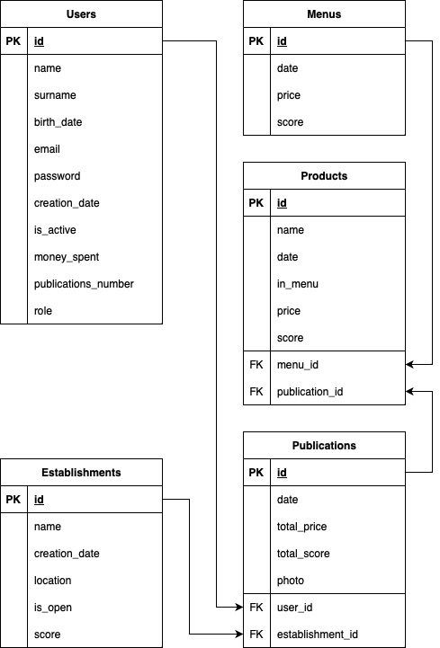
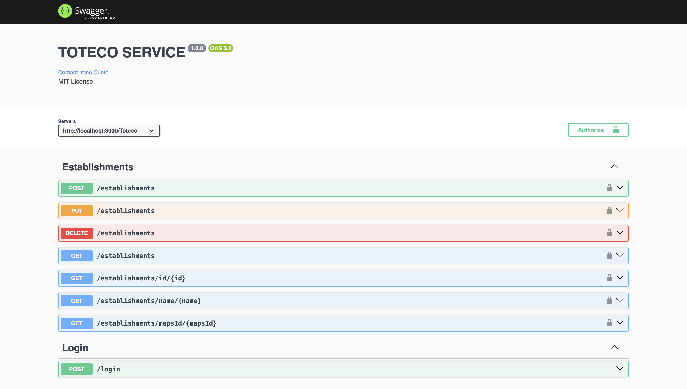

# TOTECO



## Getting started 🚀

The instructions below will allow you to get a copy of this project running in your computer for development and tests purposes.

## Requirements 📋

* Basic knowledge of NodeJs projects
* Advanced knowledge in Typescript/Javascript language
* Have NodeJs installed in the local machine that we are going to use

## Installation 🔧

First of all, we will clone the repository using the command prompt:

```
git clone https://github.com/cunba/toteco_backend_node.git
```

Then we will need to install the modules that we are using in the project that are defined in the package.json:

```
npm install
```

## Usage 📦

We can launch the application using one of these commands:

```
npm start
or
npx ts-node src/main.ts
```

_Note: to make secured requests to the Api we will need the certifications, you can ask any member of the project to provide them to you or make your own certficates._

After seeing the message that the Api is running in port X we can go to the host provided in the config (or to localhost if not provided) and make requests using swagger.



This is an example of the swagger page, to get here we use the url
```
https://localhost:3000/swagger/
```

## Authors ✒️

* **Irene Cunto** - [contact](mailto:irene.cunto-baranda@siemens.com?subject=[GitLab]%20SCANIA%20gateway)
